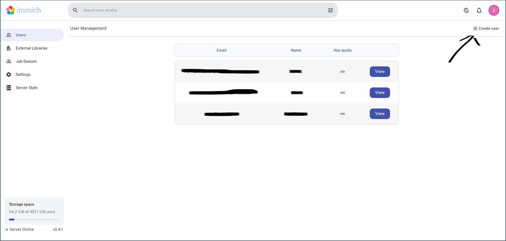
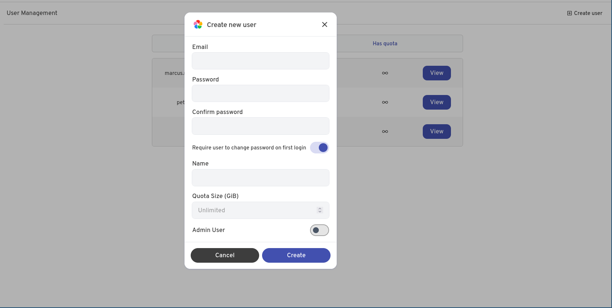
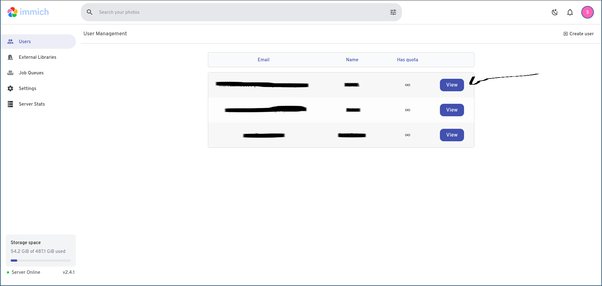
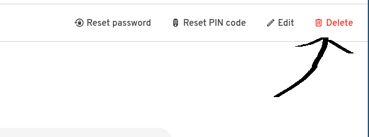
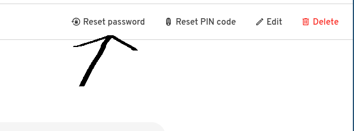
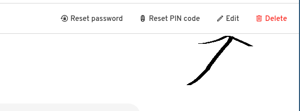

You need to be an admin for all of these steps

# Adding Users to Immich

1. Visit `https://<IMMICH SERVER URL>/admin/users`
2. Click "Create User" in top corner

3. Enter the user's details, and optionally force them to create a new password when they log in.
    You can ignore the Quota Size limit as this is unimportant for a normal setup. and you can optionally make them an admin (letting them reset others passwords & create/delete users and shared folders)

4. Let them log in

# Delete Users
1. visit `https://<IMMICH SERVER URL>/admin/users`
2. Click view next to the user

3. Click the red DELETE button (You can't delete yourself or the 1st admin)

# Managing Users
1. visit `https://<IMMICH SERVER URL>/admin/users`
2. Click view next to the user

3. From here you can reset their password (will generate a temporary password and then ask them to change it on next login)

4. You can also edit their username or email here
